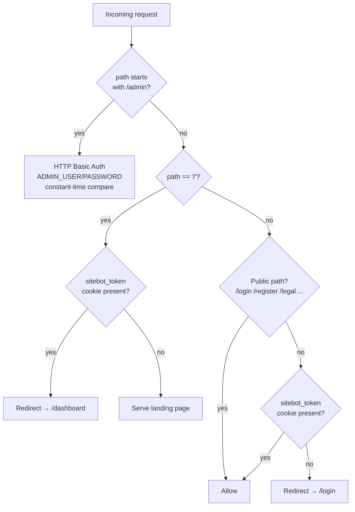

# Frontend (`web/`)

Next.js 15, App Router, server components by default with server actions for
mutations (`web/app/actions.ts`) instead of a separate client-side API
layer. No client-side state management library — data is fetched
server-side and passed down as props.

## Routing & access control



`web/middleware.ts` runs on every request (matcher excludes static assets).
Two independent guards live here:

1. **`/admin*`** uses HTTP Basic Auth against `ADMIN_USER`/`ADMIN_PASSWORD`
   — entirely separate from the dashboard's own session, since it's the
   platform operator's view, not a site owner's. Credentials are compared
   with a constant-time `safeEqual()` to avoid leaking which field is wrong
   via response timing.
2. **Everything else** checks for the `sitebot_token` cookie (set on
   login/register via a server action). Authenticated users hitting `/` are
   redirected straight to `/dashboard`; everyone else hitting a
   non-public route without the cookie is redirected to `/login`.

Note the exact-match on `'/'` (as opposed to a prefix match) — with
`startsWith`, every route would incorrectly be treated as public.

## Directory structure

```
web/app/
├── page.tsx                          # Public landing page
├── login/, register/,
│   forgot-password/, reset-password/ # Public auth flows
├── legal/                            # Terms, privacy, cookies, DPA
├── dashboard/
│   ├── page.tsx                      # Site list
│   └── sites/[id]/
│       ├── page.tsx                  # Site detail: status, settings, embed snippet
│       ├── landing/page.tsx          # Live preview with the widget injected
│       └── conversations/
│           ├── page.tsx              # Conversation list
│           └── [sessionId]/page.tsx  # Full transcript + feedback
├── admin/                            # Operator-only (Basic Auth)
│   ├── page.tsx                      # Cross-tenant overview
│   ├── sites/page.tsx
│   └── users/page.tsx
├── api/sites/[id]/pages/[pageId]/    # Route handler (proxies a page fetch)
└── actions.ts                        # Server actions: login, create/crawl/delete site, etc.

web/components/
├── ui/                                # Design-system primitives (Button, Card, Table, Alert, ...)
├── ChatPlayground.tsx                 # In-dashboard chat tester (calls /chat like the real widget)
├── CrawlProgress.tsx                  # Polls crawl job status, shows live progress
├── PageDetailModal.tsx                # Renders a single indexed page's Markdown
├── SiteFooter.tsx / legal/LegalPage.tsx
└── WidgetEmbed.tsx                    # Renders the copy-paste embed snippet

web/lib/
├── api.ts                             # Typed fetch wrappers + shared types mirroring the API's DTOs
├── format.ts                          # Date/number formatting
├── markdown.ts                        # Minimal Markdown → HTML for chat rendering
└── cn.ts                              # className merge utility
```

## Server actions instead of a client API layer

`web/app/actions.ts` exports `'use server'` functions
(`createSiteAction`, `crawlSiteAction`, `loginAction`, ...) called directly
from form submissions and buttons. This keeps API calls, cookie handling,
and redirects server-side, and avoids exposing the API's bearer token to
client-side JavaScript at all — the JWT lives only in the `sitebot_token`
HTTP cookie, read server-side in `lib/api.ts`.

`lib/api.ts` distinguishes two base URLs:

- `PUBLIC_API_URL` (`NEXT_PUBLIC_API_URL`) — used by client components that
  need to hit the API directly (e.g. the chat widget preview).
- `SERVER_API_URL` (`API_URL`, falling back to the public URL) — used by
  server components/actions, allowing the Docker Compose setup to route
  server-to-server calls over the internal Docker network
  (`http://api:3001`) while the browser still talks to `localhost:3001`.

## Live crawl progress

`CrawlProgress.tsx` polls `/sites/:id/status` on an interval while a crawl
job's status is `running`, driving a progress indicator (pages found vs.
crawled) without needing WebSockets or SSE on the dashboard side — only the
public chat endpoint uses streaming.

## Chat playground

`ChatPlayground.tsx` lets a site owner test their bot from inside the
dashboard by calling the exact same public `/chat` endpoint the embedded
widget uses, with the same SSE streaming and source citations — so what the
owner sees in the playground is a faithful preview of the visitor
experience.

## The embeddable widget is not part of the Next.js app

`api/src/public/widget.js` is a standalone, dependency-free vanilla
JavaScript file served by the **API**, not built or bundled by Next.js. It
renders its own chat bubble UI, manages a `sitebot:session:<siteId>` key in
`localStorage` to persist the session ID across page loads, and calls
`/chat` directly with SSE. Site owners embed it with a single `<script>`
tag; it has no build step or framework dependency, keeping the snippet
copy-pasteable into any site regardless of that site's own stack.
