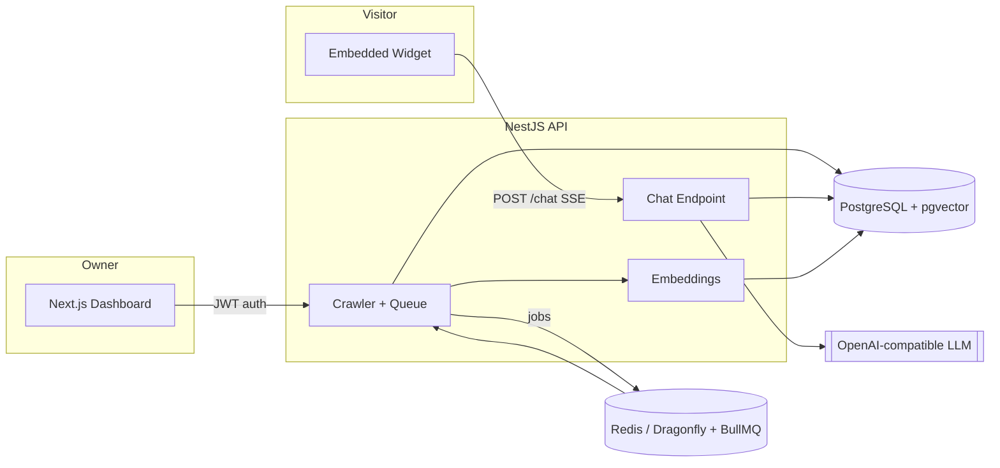

# Sitebot — Technical Documentation

Sitebot turns any website into a RAG-powered chatbot: it crawls a site, indexes
its content in PostgreSQL with `pgvector`, and serves an embeddable chat widget
that answers visitor questions using only that site's content.

This folder documents the system for engineers picking up the codebase —
architecture, data model, request flows, and operational concerns.

## Contents

| Doc | Covers |
|---|---|
| [architecture.md](./architecture.md) | System overview, component responsibilities, deployment topology |
| [data-model.md](./data-model.md) | Database schema, entity relationships, cascades |
| [crawling-pipeline.md](./crawling-pipeline.md) | How a site gets discovered, fetched, and indexed |
| [rag-pipeline.md](./rag-pipeline.md) | How a chat question becomes a grounded, cited answer |
| [api-reference.md](./api-reference.md) | HTTP endpoints, auth, rate limits |
| [security.md](./security.md) | Threat model and the specific mitigations in code |
| [frontend.md](./frontend.md) | Next.js dashboard structure and key flows |
| [setup.md](./setup.md) | Local development and Docker deployment |

## At a glance

**Stack:** NestJS + Drizzle ORM (API) · Next.js 15 (dashboard) · PostgreSQL 16 +
pgvector · Redis-compatible Dragonfly + BullMQ (crawl queue) · local
`multilingual-e5-small` embeddings via transformers.js, with an OpenAI-compatible
provider for chat completions.
