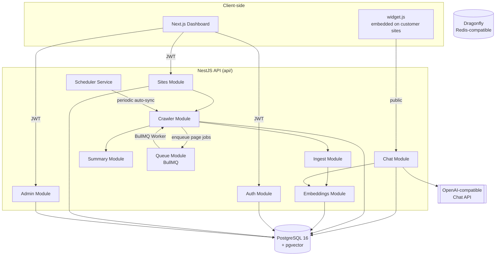
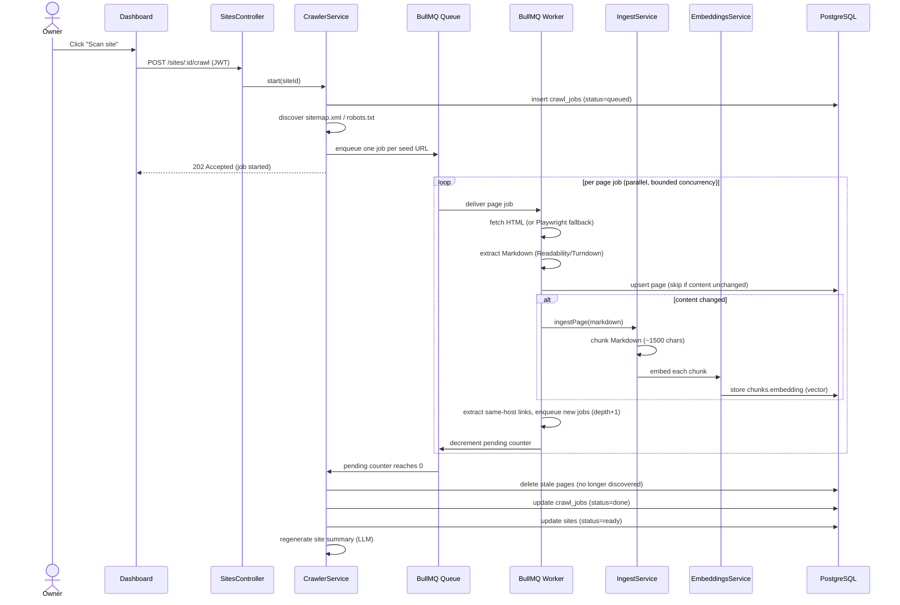
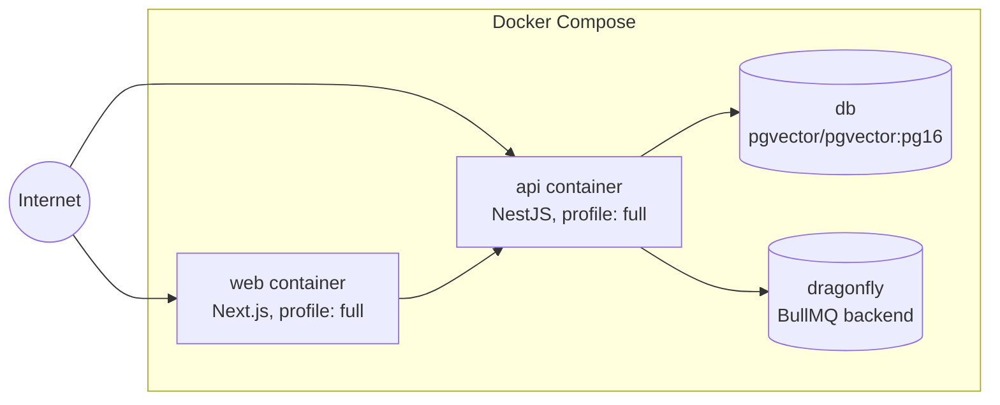

# Architecture

## Two independent apps

`api/` and `web/` are separate Node projects, each with its own
`package.json`, lockfile, and `node_modules`. They only communicate over
HTTP — there is no shared TypeScript package or monorepo tooling (aside from
a `pnpm-workspace.yaml` used solely to allowlist native build scripts).

| App | Framework | Responsibility |
|---|---|---|
| `api/` | NestJS + Drizzle ORM | Auth, site management, crawling, embeddings, chat/RAG, admin |
| `web/` | Next.js 15 (App Router) | Owner-facing dashboard: create sites, trigger crawls, view conversations |

The **chat widget** (`api/src/public/widget.js`) is a third, much smaller
runtime: a dependency-free vanilla JS script served directly by the API and
embedded on the *customer's* website, not on `web/`.

## Component map

## Request flow: crawling a site

## Why a queue instead of an in-process loop

Early designs walked a site breadth-first inside a single async function.
The current design gives each discovered page its own BullMQ job:

- **Concurrency is a Worker setting** (`CRAWL_PAGE_CONCURRENCY`, default 8),
  applied *globally* across all sites being crawled at once — not per-site
  batching.
- **Crashes are recoverable**: BullMQ persists jobs in Redis; a restarted API
  process picks up where it left off instead of losing an in-memory queue.
- **Coordination state lives in Redis**, keyed per crawl job
  (`crawl:<id>:seen`, `:pending`, `:visited`, `:meta`), not in a
  service-level Map that would leak across requests or be lost on restart.
- **Finalization is a race-free counter**: every enqueued page increments a
  `pending` counter; every completed page (success *or* exhausted retries)
  decrements it. Whichever worker takes it to zero triggers `finalize()`,
  guarded by a Redis `SET NX` lock so it only runs once.

See [crawling-pipeline.md](./crawling-pipeline.md) for the full mechanics.

## Deployment topology

`db` and `dragonfly` run by default (`docker compose up -d db`); `api` and
`web` are gated behind the `full` Compose profile, since local development
typically runs them directly with `pnpm dev` for fast reload. The API
container mounts a `modelcache` volume so the local embedding model
(downloaded from Hugging Face on first run) survives container rebuilds.

## Module responsibilities (`api/src/`)

| Module | Key files | Responsibility |
|---|---|---|
| `auth/` | `auth.service.ts`, `auth.guard.ts` | Register/login, JWT issuance, password reset |
| `sites/` | `sites.service.ts`, `sites.controller.ts` | CRUD for sites, settings, origins |
| `crawler/` | `crawler.service.ts`, `scheduler.service.ts`, `robots.ts`, `sitemap.ts`, `url.ts`, `reconcile.ts` | Discovery, fetching, BullMQ worker, auto-sync scheduling |
| `ingest/` | `chunker.ts`, `ingest.service.ts` | Markdown chunking and chunk persistence |
| `embeddings/` | `embedding-provider.ts`, `local-embedding.provider.ts`, `openai-embedding.provider.ts` | Pluggable embedding backends |
| `chat/` | `chat.service.ts`, `chat.controller.ts` | Hybrid retrieval, prompt construction, SSE streaming |
| `summary/` | `summary.service.ts` | LLM-generated one-paragraph site summary |
| `admin/` | `admin.service.ts`, `admin.guard.ts` | Platform-operator views (Basic Auth, separate from user JWT) |
| `queue/` | `queue.module.ts`, `bull-board.module.ts` | BullMQ queue wiring, Bull Board UI |
| `security/` | `ssrf.ts` | DNS-based SSRF guard for crawl targets |
| `mail/` | `mail.service.ts` | SMTP password-reset emails |
| `usage/` | `usage.service.ts` | Token/cost accounting per site |
