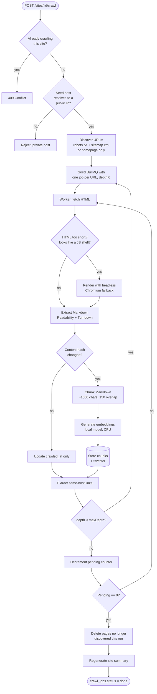

# Crawling & Indexing Pipeline

Source: `api/src/crawler/`, `api/src/ingest/`, `api/src/embeddings/`.

## Overview

## Discovery

`CrawlerService.start()` tries, in order:

1. **`sitemap.xml`** (`discoverSitemapUrls` in `sitemap.ts`) — including
   sitemap *indexes* that reference other sitemaps. Capped at `maxPages`.
2. If no sitemap or it's incomplete, the crawler falls back to **breadth-first
   link discovery** starting from the homepage, following only same-host
   links (`isSameHost`, `url.ts`) up to `maxDepth` levels.

`robots.txt` is fetched once per crawl (`RobotsPolicy` in `robots.ts`) and
every candidate URL is checked against its disallow rules before fetching.

## Fetching

`fetchOne()` (`crawler.service.ts`) tries a plain `fetch()` first
(`http.ts`). If the response is too short or looks like an empty JS
shell (`JS_SHELL_MIN_CHARS = 500`), and `CRAWL_RENDER_JS=true` (default), it
falls back to a headless **Playwright** Chromium instance. Playwright is
**deferred-imported** — `import('playwright')` only happens on first actual
use — so disabling JS rendering entirely skips loading the ~100s-of-MB
dependency, keeping the container lighter when it isn't needed.

If the server responds with a blocking status (e.g. 403, a WAF challenge),
the page is marked `blocked` and Playwright is *not* attempted — a blocking
response means the browser won't fare better either.

## Extraction

`htmlToMarkdown()` (`html-to-markdown.ts`) runs Mozilla Readability to
isolate the main content, then Turndown to convert it to Markdown. The result
is hashed (`content_hash`) to detect no-op re-crawls.

## Chunking

`chunkMarkdown()` (`ingest/chunker.ts`) splits on Markdown heading boundaries
first (so a chunk doesn't straddle two unrelated sections), then hard-wraps
any oversized block at `maxChars` (default 1500) with a `overlap` character
tail carried into the next chunk (default 150), so a sentence split across
chunk boundaries still has surrounding context in at least one of them.
Chunks under 40 characters after stripping heading markers are discarded as
noise (e.g. a lone "##" with nothing under it).

## Embedding

Two interchangeable providers implement `EmbeddingProvider`
(`embeddings/embedding-provider.ts`):

| Provider | Model | Dimensions | Cost |
|---|---|---|---|
| `local` (default) | `Xenova/multilingual-e5-small` via transformers.js | 384 | Free, runs on CPU |
| `openai` | `text-embedding-3-small` (configurable) | 1536 by default | Per-token, requires `OPENAI_API_KEY` |

The active provider is selected by `EMBEDDING_PROVIDER` and resolved once at
module init (`embeddings.module.ts`). The database's `chunks.embedding`
column is fixed at 384 dimensions (`EMBEDDING_DIM` in `schema.ts`), so
switching to the OpenAI provider's default dimensionality would require a
schema migration.

## Coordination via Redis (not in-process state)

Because each page is its own BullMQ job — potentially processed by different
event-loop turns or, in a multi-instance deployment, different processes —
crawl-run state lives in Redis, namespaced per `crawlJobId`:

| Key | Type | Purpose |
|---|---|---|
| `crawl:<id>:seen` | Set | Every URL enqueued so far (dedup) |
| `crawl:<id>:pending` | Counter | Jobs enqueued minus jobs completed |
| `crawl:<id>:visited` | Set | URLs successfully fetched (used for reconciliation) |
| `crawl:<id>:meta` | Hash | Site URL, limits, sitemap completeness, blocked-response count |
| `crawl:<id>:finalizing` | Lock (`SET NX`) | Ensures `finalize()` runs exactly once |
| `site:<id>:activeCrawl` | String | Prevents starting a second concurrent crawl for the same site |

**Finalization race:** every `enqueuePage()` increments `pending`; every
`processPage()` exit path (success, skip, or exhausted retries on failure)
decrements it via `decrementAndMaybeFinalize()`. The worker that decrements
it to `0` calls `finalize()`. Because multiple workers could theoretically
hit zero near-simultaneously, `finalize()` is additionally guarded by a
Redis `SET key 1 EX 300 NX` lock — only the worker that successfully sets
the lock proceeds.

## Reconciliation

When a crawl finishes (and the crawl was complete — sitemap-driven or under
the page cap), `reconcile()` compares the site's stored `pages` against the
set of URLs actually visited this run (`computeStaleUrls`, `reconcile.ts`)
and deletes any page no longer discoverable — handling deleted or moved
pages on the source site. Reconciliation is **skipped** if the crawl hit
`maxPages` without a complete sitemap, since an incomplete crawl can't
distinguish "page removed" from "page not reached yet."

## Auto-sync

`scheduler.service.ts` runs a periodic check (`SYNC_INTERVAL_MINUTES`,
default 60) and re-triggers `CrawlerService.start()` for any site with
`autoSync = true` whose `lastCrawledAt` is older than its own
`syncIntervalHours`.

## Incremental single-page refresh

`CrawlerService.refreshPage()` lets the dashboard force a re-fetch of one
specific URL (e.g. "this page looks stale") outside of a full crawl —
validated against the same same-host, robots, and SSRF checks, then run
through the same extract → hash-check → chunk → embed pipeline.
