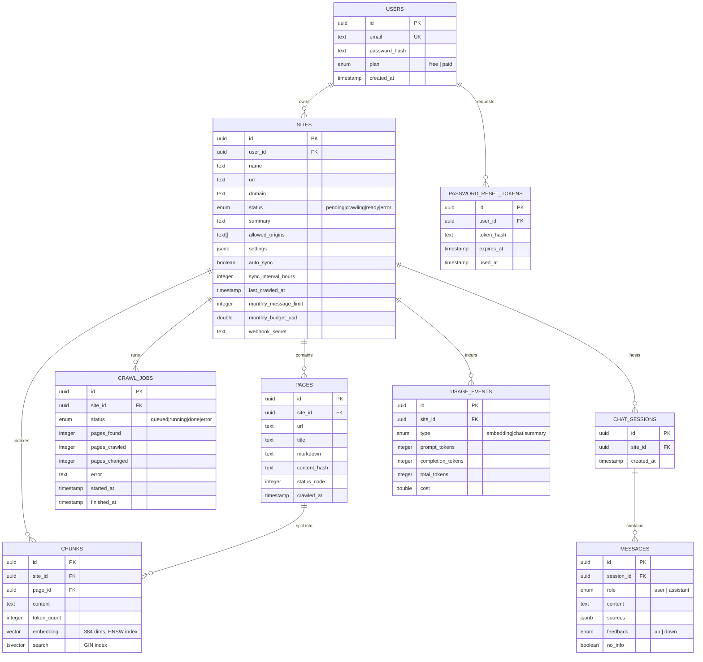

# Data Model

PostgreSQL 16 with the `pgvector` extension, managed through Drizzle ORM
(`api/src/db/schema.ts`). All tables use UUID primary keys and cascade
deletes downward from `users`.

## Entity-relationship diagram

## Notable design choices

**Cascading deletes everywhere.** Every foreign key uses
`onDelete: 'cascade'`. Deleting a `user` deletes every `site` they own, which
in turn deletes its `pages`, `chunks`, `crawl_jobs`, `chat_sessions`, and
`messages`. There is no soft-delete layer — this is a deliberate simplicity
trade-off suited to a single-tenant-per-owner model.

**`chunks.embedding` is a 384-dimension vector** (`EMBEDDING_DIM` in
`schema.ts`), matching the local `multilingual-e5-small` model's output size.
Switching to the OpenAI embedding provider (`text-embedding-3-small`, 1536
dims by default) would require a schema migration to change the vector
column's dimensionality — the codebase is currently pinned to 384.

**Two indexes on `chunks` power hybrid retrieval:**
- `chunks_embedding_idx`: an **HNSW** index using `vector_cosine_ops`, for
  fast approximate nearest-neighbor search over embeddings.
- `chunks_search_idx`: a **GIN** index over a generated `tsvector` column,
  for PostgreSQL full-text (lexical) search.

Both are queried per chat request and merged via Reciprocal Rank Fusion — see
[rag-pipeline.md](./rag-pipeline.md).

**`sites.settings` is a typed JSONB blob** (`SiteSettings`), not normalized
columns — widget color, greeting, custom system-prompt addendum, LLM
temperature, and crawl limits (`maxPages`, `maxDepth`) all live there with
defaults in `DEFAULT_SETTINGS`. This avoids a migration for every new
per-site knob at the cost of losing column-level constraints.

**`pages.content_hash`** is a hash of the extracted Markdown. Re-crawling a
page whose hash hasn't changed skips re-ingestion (re-embedding) entirely —
the crawler only re-chunks and re-embeds content that actually changed.

**`messages.no_info`** is set when the LLM's answer matches one of the
"I don't know" phrase markers (`isNoInfoAnswer` in `chat.service.ts`). This
flag drives the admin dashboard's visibility into answer quality without
requiring a separate classification call.
