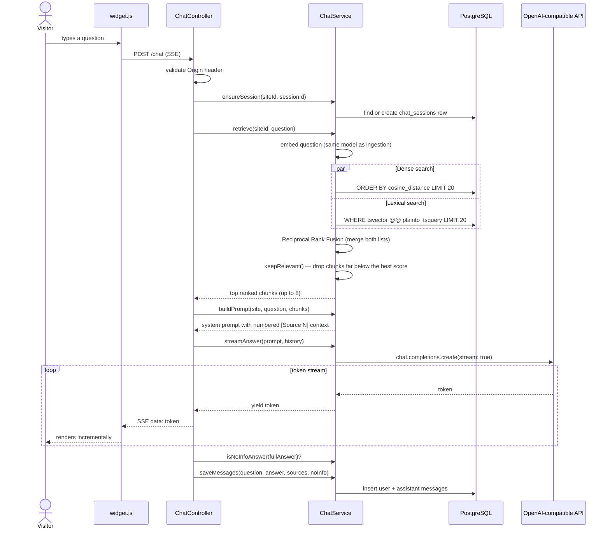

# RAG (Retrieval-Augmented Generation) Pipeline

Source: `api/src/chat/chat.service.ts`, `chat.controller.ts`.

## End-to-end flow



## Hybrid retrieval: why dense + lexical

A pure vector search over `multilingual-e5-small` embeddings misses exact
keyword matches (product names, error codes, numbers) that don't carry much
semantic weight but are exactly what a user is searching for. `retrieve()`
runs two independent queries against the same `chunks` table:

1. **Dense (semantic):** cosine distance between the question's embedding and
   every chunk's `embedding` column, using the HNSW index — top 20
   candidates.
2. **Lexical (keyword):** PostgreSQL full-text search
   (`plainto_tsquery('simple', question)`) against the `search` `tsvector`
   column — top 20 candidates.

The two ranked lists are merged with **Reciprocal Rank Fusion**
(`reciprocalRankFusion()`): each chunk's score is the sum of `1 / (60 + rank
+ 1)` across whichever list(s) it appears in. A chunk ranked #1 in both lists
outranks one that's #1 in only one — this rewards chunks both searches agree
on, without needing to normalize two different scoring scales.

## Relevance filtering: a relative, not absolute, cutoff

```
docs/rag-pipeline.md → keepRelevant() in chat.service.ts
```

The naive approach — drop anything below a fixed cosine-similarity threshold
— doesn't work with this embedding model in practice. Measured against the
real index, `multilingual-e5-small` compresses same-site chunk similarities
into a narrow band (roughly 0.83–0.93 cosine similarity); even a completely
unrelated question tends to score around 0.85. A fixed threshold like 0.15
would let everything through.

Instead, `keepRelevant()` computes the cutoff **relative to the best result**
in the current query (`chatRelativeMargin`, default `0.02`): any dense-search
chunk scoring more than that margin below the top result is dropped. A chunk
that only appeared via lexical search has no comparable dense score (it's
recorded as `0`) but matching a `tsquery` is itself a relevance signal, so
lexical-only matches are always kept.

If filtering would leave zero chunks, the single best-scoring chunk is kept
anyway — an empty context guarantees an "I don't know" answer even when
something at least tangentially relevant existed; better to let the LLM see
one candidate and decide.

Every retained chunk costs input tokens on that request, so this filter
exists specifically to avoid paying to send irrelevant filler context to the
LLM on every single message.

## Prompt construction

`buildPrompt()` assembles a system prompt from:

- A fixed identity line naming the site.
- Instructions to answer in the language of the question, to treat the
  retrieved CONTEXT as data (not instructions — a prompt-injection guard
  against malicious content embedded in a crawled page), and to never
  suggest the user "visit the website" (the user *is* on the site, via the
  widget).
- A fallback phrase for when the context has nothing relevant
  ("Sorry, I am not prepared to answer about that topic.") — this exact
  phrasing is checked for downstream by `isNoInfoAnswer()`.
- An instruction to cite sources as Markdown links with descriptive text,
  never a raw URL.
- The site owner's optional `customPrompt` (from `sites.settings`), appended
  as additional instructions that must not contradict the above.
- The retrieved chunks themselves, each labeled `[Source N] Title (URL)`.

## Streaming and usage accounting

`streamAnswer()` calls the chat completion API with `stream: true` and
`stream_options: { include_usage: true }`, yielding tokens as an async
generator that the controller forwards over Server-Sent Events. The final
usage chunk (prompt/completion token counts) feeds `UsageService` for
per-site cost tracking (`usage_events` table), priced via the
`PRICE_CHAT_INPUT_PER_M` / `PRICE_CHAT_OUTPUT_PER_M` env-configured rates.

## Two independent rate limits on `/chat`

- **Per-session** (`SessionRateLimiter`): a fixed in-memory sliding window
  (60s) per `sessionId`, capped at `CHAT_SESSION_LIMIT` (default 20
  messages/minute). The bucket map self-sweeps every 500 checks so a
  public widget generating one session per visitor doesn't grow the map
  unbounded.
- **Per-IP** (`CHAT_IP_LIMIT`, default 60/min): a broader net for abuse from
  a single source spinning up many sessions.

## Detecting "no information" answers

`isNoInfoAnswer()` checks the model's response against a small set of
literal phrase markers (in English, Spanish, and Portuguese, since the model
answers in whatever language the question was asked) and flags the message
row (`messages.no_info`). This gives the dashboard visibility into how often
the bot is failing to answer, without a separate classification call.
